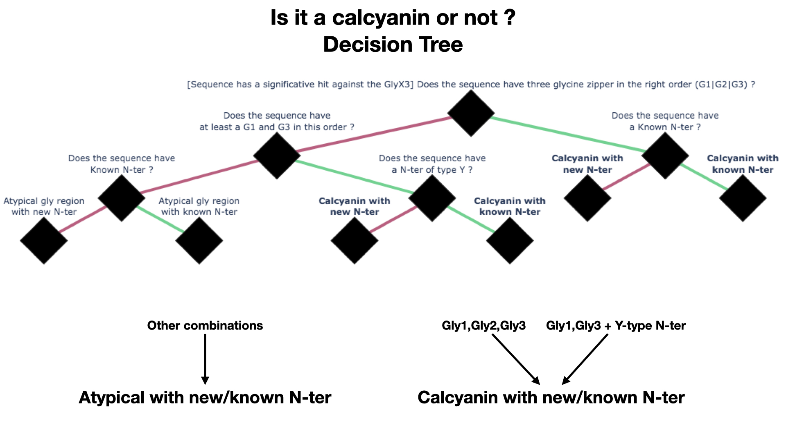
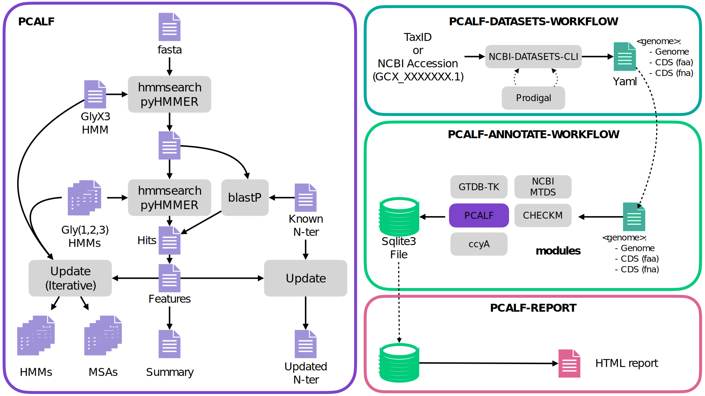

# PCALF - Retrieve Calcyanin protein and ccyA gene from genomes. 


PCALF stand for Python CALcyanin Finder.


Benzerara, K., Duprat, E., Bitard-Feildel, T., Caumes, G., Cassier-Chauvat, C., Chauvat, F., ... & Callebaut, I. (2022). [A new gene family diagnostic for intracellular biomineralization of amorphous Ca carbonates by cyanobacteria](https://doi.org/10.1093/gbe/evac026). Genome Biology and Evolution, 14(3), evac026. 

<br><br>

# Table of Contents :
- [Calcyanin detection](#Calcyanin-detection-)
- [Decision tree](#Decision-tree-)
- [Installation](#Installation-)
  - [Dependencies](#Dependencies-)
  
- [Usage](#Usage-)
  - [pcalf](#pcalf-)
  - [pcalf-datasets-workflow](#pcalf-datasets-workflow-)
  - [pcalf-annotate-workflow](#pcalf-annotate-workflow-)
  - [pcalf-report](#pcalf-report-)
- [Workflow](#Workflow-)


<br><br>
## Calcyanin detection :

The ccyA gene is searched at the protein level following a simple [decision tree](#Decision-tree-) based on the specific composition of the C-ter extremity of this protein.
We use a weighted HMM profile specific of the glycine zipper triplication (aka GlyX3) to detect sequences with a putative glycine triplication. Sequences with at least one hit against this profile are annotated with three HMM profiles specific of each Glycine zipper : Gly1, Gly2 and Gly3. 
A set of known calcyanins is used to infere the type of the N-ter extremity (X, Z, Y, CoBaHMA or ?). Finally, a flag is assign to each sequence depending on 
its N-terminus type and its C-terminus modular organization.

<br><br>
## Decision tree :

<!--  -->


## Installation :

```bash
mamba create -n pcalf -c k2sohigh pcalf;
```
or 
```bash
pip3 install pcalf;
```

### Dependencies :
```python
python==3.9
pyhmmer==0.7.1
biopython==1.81
numpy>=1.21
pyyaml>=6
snakemake==7.22
pandas==1.5.3
tqdm==4.64.1
plotly==5.11.0
python-igraph==0.10.4
```

### External dependency :
```
blast
```
<br><br>
## Usage :

Pcalf is composed of several commands :
- [pcalf](#pcalf-)
- [pcalf-datasets-workflow](#pcalf-datasets-workflow-)
- [pcalf-annotate-workflow](#pcalf-annotate-workflow-)
- [pcalf-report](#pcalf-report-)

---

### pcalf : 

This command can be used to look quickly for the presence of calcyanin in a set of amino acid sequences. It take one or more fasta files as input and output several files including a summary, a list of features and a list of raw hits produced during the search. It also produce updated HMMs and updated MSAs with newly detected calcyanin tagged as Calcyanin with known N-ter. 

```
pcalf -i proteins.fasta 
      -o pcalf_results 
      --iterative-search
      --iterative-update 
      --gly1-msa custom_gly1_msa.fasta
```
--iterative-search : If True, the search will be performed with profiles produced by the previous iteration until there is no new sequence detected or if --max-iteration is reached.

--iterative-update : True calcyanins (if any) will be added to the HMMs profiles iteratively starting with the best sequence (based on feature' score).

--gly1-msa : Use another MSA instead of the default one. A HMM profile will be built from the given MSA and Glycine weight will be increased.


#### Thresholds:
By default, coverage and E-value threshold are infered from the HMM profiles that will be used for the search. To define the thresholds, a MSA is converted into a simple fasta file by deleting all gaps and aligned against its own HMM profile. A soft filtering is made using a coverage threshold of 0.5. The maximum E-values ​​and the minimum coverage values ​​are used to define the thresholds as follows : `max(E-value)*10, min(coverage)-0.1`


---

### pcalf-datasets-workflow : 

pcalf-datasets-workflow can be used to retrieve genomes from NCBI databases such as RefSeq and GenBank based on accession (e.g GCA_012769535.1) or TaxID.

Genomes and annotations (genes and CDS) will be downloaded using the new command line tools from [NCBI](https://www.ncbi.nlm.nih.gov/datasets/docs/v2/download-and-install/). If annotations does not exists for a genome, then genes and CDS will be predicted using [Prodigal](https://github.com/hyattpd/Prodigal).

A yaml file is also produced and can be used as input for [pcalf-annotate-workflow](#pcalf-annotate-workflow-).
```
GCA_012769535.1:
  genome : /path/to/genome.gz
  cds_faa: /path/to/cds_faa.gz
  cds_fna: /path/to/cds_fna.gz
GCF_012769535.1:
...
```

example :

```
pcalf-datasets-workflow -t 1117 
                        -o pcalf_datasets_results 
                        -a file_with_accession.txt 
                        -e file_with_accession_to_ignore.txt
```

The command above will download all cyanobacteria genome (taxid : 1117) and genomes specified in file_with_accession.txt. If any of them are specified in file_with_accession_to_ignore.txt, then they will be ignored.

---

### pcalf-annotate-workflow : 

pcalf-annotate-workflow is actually the workflow that will help you recover calcyanin proteins and ccyA genes from a set of genomes.
This workflow is composed of multiple steps :
- genome taxonomic classification using [GTDB-TK V2](https://github.com/Ecogenomics/GTDBTk)
- genome quality assessment using [CheckM](https://github.com/Ecogenomics/CheckM/)
- calcyanin detection using [pcalf](#paclf-)
- calcyanin / ccyA linking using a specific python script.
- NCBI metadatas recovery using [NCBI](https://www.ncbi.nlm.nih.gov/datasets/docs/v2/)

Note, that GTDB-TK and checkM requires external databases, respectively [GTDB](https://gtdb.ecogenomic.org/downloads) and [CheckM datas](https://data.ace.uq.edu.au/public/CheckM_databases). In addition, it's advised to run GTDB-TK and CheckM on a computer cluster. Because pcalf-annotate-workflow rely on snakemake you can easily provide a snakemake profile through the --snakargs option to run it on your favorite cluster. On the other hand, you can skip the genome taxonomic classification and the quality assessment with the --quick flag.

pcalf-annotate-workflow take as input a yaml file with a specific format, see [pcalf-datasets-workflow](#pcalf-datasets-workflow-) for details.

example : 

```
pcalf-annotate-workflow -i input_file.yaml 
                        -o pcalf_annotate_results 
                        --db db_file_from_another_run.sqlite3 
                        --snakargs "--profile my_slurm_profile --use-conda --jobs 50" 
                        --gtdb my_gtdb_directory 
                        --checkm my_checkm_datas_directory
```

The command above will process all the genome specified in input_file.yaml through the pcalf-annotate-workflow including checkm and gtdb-tk steps. The sqlite3 file produced will be merged with db_file_from_another_run.sqlite3. The workflow will be ran on your computer cluster with 50 jobs at a time. See [snakemake documentation](https://snakemake.readthedocs.io/en/stable/) for details about cluster execution.

Several output files for each step will be produced but the final output is a sqlite3 database storing multiple tables: 
```
- genome          # NCBI metadatas
- gtdbtk          # GTDB-TK classification results
- checkm          # Checkm Results 
- summary         # PCALF summary table
- features        # PCALF features table
- hits            # PCALF hits table
- ccyA            # ccyA table
- gly1            # Gly1 MSA
- gly2            # Gly2 MSA
- gly3            # Gly3 MSA
- glyx3           # Glyx3 MSA
- nterdb          # N-ter table
```

You can use the sqlite3 database from another run as a basis for a new one. In this case, MSAs stored in the sqlite3 file will be used to generate HMM profiles for [pcalf](#pcalf-).

---

### pcalf-report : 

This command produce an HTML report from a sqlite3 database given by [pcalf annotate workflow](#pcalf-annotate-workflow-).

example :

```
pcalf-report --db sqlite3_file.sqlite3 --out report.html
```

---
<br><br>
## Workflow : 



