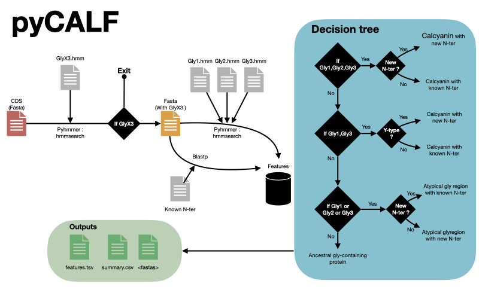

# pyCALF

            _ (.".) _    
           '-'/. .\'-'   
             ( o o )     
              `"-"`  


pyCALF stand for python CALcyanin Finder

The input fasta file will be scanned in searched of calcyanin following three steps:
  - First a specific HMM profile of the glycine triplication will be searched using HMMSEARCH.
  - Secondly, sequences with a hit in step 1 will be more precisely annotated using specifics HMM profiles for each glycine zipper.
  - Finally, a set of known N-ter will be blast against sequences with a hit in step 1.

## Dependencies :
- pandas
- pyhmmer
- biopython
- numpy==1.22.4

## External dependencies
- blast 


## Input :
input_file: amino acide sequence fasta file

## Output :

```
.
├── fastas/calcyanin.fasta
├── intermediates
│   ├── calglyx3.csv
│   ├── calglyzips.csv
│   └── calnter.csv
├── summary.csv
└── features.csv
```

## INSTALLATION

```bash
mamba create -n pycalf -c bioconda blast python=3.9 && conda activate pycalf;
pip3 install git@github.com:K2SOHIGH/pyCALF.git
```

## USAGE

```bash
pycalf --help
```

```bash
usage: pycalf [-h] -i TRANSLATED_CDS_INPUT [-e FILE_EXTENSION] -o RES_DIR [--log LOG] [--glyx3-hmm GLYX3_PHMM] [--domz DOMZ] [--glyx3-coverage GLY3_COVERAGE_THRESHOLD]
              [--glyx3-evalue GLY3_EVALUE_THRESHOLD] [--glyx3-i-evalue GLY3_I_EVALUE_THRESHOLD] [--nterdb NTERDB_FA] [--nter-mapping-file NTERDB_TAB] [--nter-coverage NTER_COVERAGE]
              [--nter-evalue NTER_EVALUE] [--gly1-phmm GLY1_PHMM] [--gly2-phmm GLY2_PHMM] [--gly3-phmm GLY3_PHMM] [--glyzip-i-evalue GLYZIP_I_EVALUE] [--glyzip-evalue GLYZIP_EVALUE] [--threads THREADS]

        pyCALF

                           _(__)_        V
                          '-e e -'__,--.__)
                           (o_o)        ) 
                              \. /___.  |
                              ||| _)/_)/
                             //_(/_(/_(

                        
pyCALF stand for python CALcyanin Finder. The input fasta file will be scanned in searched of calcyanin following three steps:
  - First a specific HMM profile of the glycine triplication will be searched using HMMSEARCH.
  - Secondly, sequences with a hit in step 1 will be more precisely annotated using specifics HMM profiles for each glycine zipper.
  - Finally, a set of known N-ter will be blast against sequences with a hit in step 1.
        

options:
  -h, --help            show this help message and exit
  -i TRANSLATED_CDS_INPUT
                        yaml file, fasta file or directory containing cds fasta files
  -e FILE_EXTENSION     input files extension
  -o RES_DIR            output directory
  --log LOG             log file
  --glyx3-hmm GLYX3_PHMM
                        path to GlyX3 hmm profile" 
  --domz DOMZ           sequence space size (default: 10000)"
  --glyx3-coverage GLY3_COVERAGE_THRESHOLD
                        minimal coverage to be considered as a potential calcyanin (default: 0.62)
  --glyx3-evalue GLY3_EVALUE_THRESHOLD
                        hit's evalue threshold (default: 1e-30)
  --glyx3-i-evalue GLY3_I_EVALUE_THRESHOLD
                        domain's i_evalue threshold (default: 1)
  --nterdb NTERDB_FA    path to nterdb fasta file
  --nter-mapping-file NTERDB_TAB
                        path to nterdb mapping file
  --nter-coverage NTER_COVERAGE
                        nter minimal coverage (default: 80)
  --nter-evalue NTER_EVALUE
                        nter evalue threshold (default: 1e-07)
  --gly1-phmm GLY1_PHMM
                        path to GlyZip1 hmm profile 
  --gly2-phmm GLY2_PHMM
                        path to GlyZip2 hmm profile 
  --gly3-phmm GLY3_PHMM
                        path to GlyZip3 hmm profile 
  --glyzip-i-evalue GLYZIP_I_EVALUE
                        glyzip i-evalue threshold (default: 0.00036)
  --glyzip-evalue GLYZIP_EVALUE
                        glyzip evalue threshold (default: 1)
  --threads THREADS     (default: 4)
```

### WORKFLOW :
<figure><figcaption>workflow</figcaption></figure>
 
# pycalf2.0
